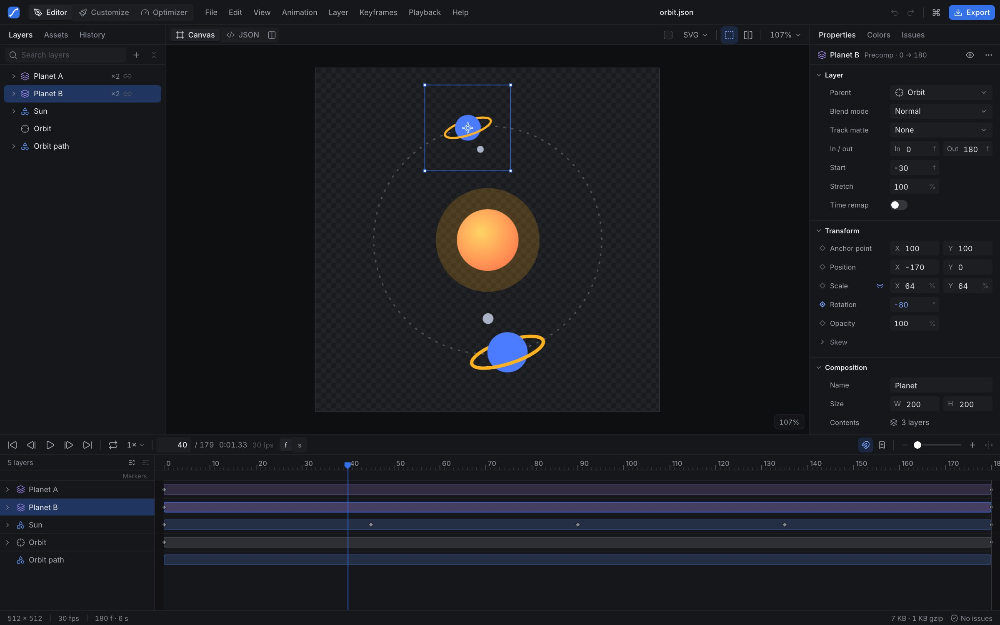
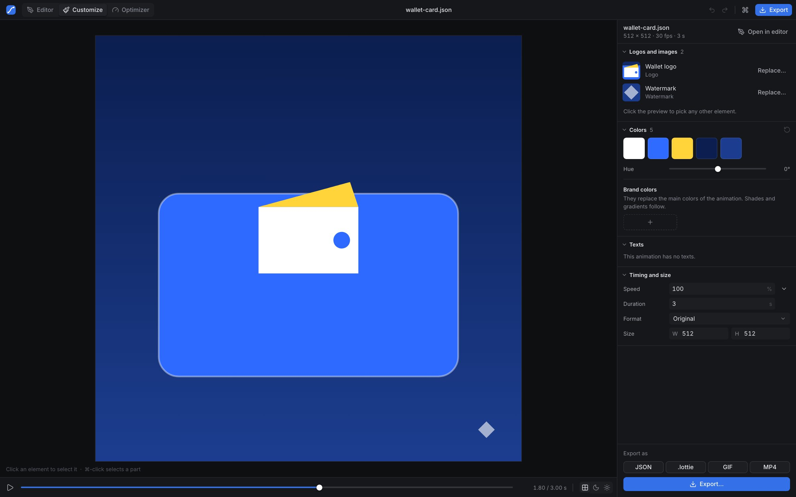
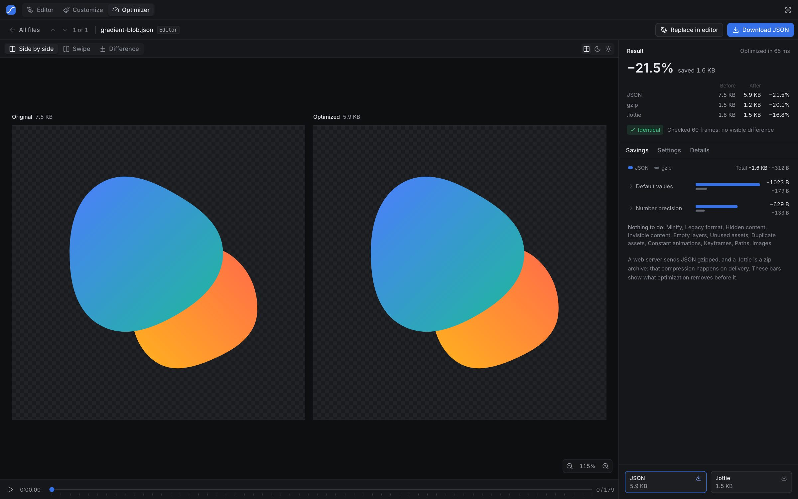

# Lottie Editor

A fast, local-first web app for working with [Lottie](https://airbnb.io/lottie/) and
[dotLottie](https://dotlottie.io/) animations. It combines three tools:

- **Editor** — a professional editor: layers, timeline, keyframes, easing, colors, JSON, export.
- **Customize** — make your own version of an existing animation: replace a logo, apply brand
  colors, edit texts, change timing and size.
- **Optimizer** — make Lottie files smaller without visible changes, verified frame by frame.

Everything runs in the browser. Files never leave your device. After the first visit the app
also works offline, and it can be installed as a desktop app that opens `.json`, `.lottie` and
`.tgs` files from the system.

**Open it:** https://merikosu.github.io/lottie-editor/



| Customize | Optimizer |
|---|---|
|  |  |

## Features

### Editor
- Opens `.json` (Bodymovin), `.lottie` (dotLottie v1/v2, several animations), `.tgs` (Telegram) and
  `.zip` exports with images: drag and drop anywhere, ⌘O, paste JSON or a link, open from URL.
- Canvas with zoom and pan, preview backgrounds, SVG/Canvas renderers, click-to-select on canvas,
  selection outlines, compare with the original. A transform box moves, resizes and rotates the
  selection (Shift keeps proportions or snaps to 15°, Alt works from the center or anchor point),
  also for several layers at once, with snapping and auto-keying at the playhead.
- Layer tree with shapes and precomps: rename, reorder by drag and drop, group, duplicate, delete,
  hide, lock, solo, re-parent (keeps layers in place), copy/paste between documents, new shape,
  text, solid, null and image layers, SVG import, precompose and release precomps.
- Timeline: transport with loop / once / ping-pong and preview speed, work area, markers, layer bars
  (move and trim), keyframes (select, marquee, drag with snapping, Alt-drag duplicate, copy/paste,
  scale, reverse, distribute), easing presets, and a graph editor (value and speed graphs,
  ⇧F3) with draggable keys and easing handles.
- Contextual inspector: document settings, layer and transform properties, every shape type,
  text, masks, gradient stops, animatable fields with keyframe controls (auto-keying),
  scrubbable number fields with math, and a cubic-bezier easing editor.
- Effects: add Fill, Tint, Tritone, Drop Shadow, Gaussian Blur, Stroke and Transform; reorder,
  duplicate, rename, reset; readable parameter names and options; which players render each one.
- Themes (dotLottie 2): turn colors into theme slots, create themes such as Dark or Brand, preview
  them on the canvas and export them in a `.lottie` file.
- Colors: the full document palette (fills, strokes, gradients, text, solids, effects, precomps,
  animated colors), global replacement, merge similar colors, hue/saturation/lightness adjustments.
- Speed, duration and frame rate changes that retime everything consistently; trim; reverse;
  ping-pong; pause at end; canvas resize, scale content and fit to content.
- Issues panel with a player compatibility matrix (web, iOS, Android, dotLottie, Telegram) and
  one-click fixes; statistics; live size (raw and gzip).
- JSON view (CodeMirror) with validation, apply/revert, reveal the selected node and split view.
- Export: Lottie JSON (minify, precision), dotLottie, Telegram sticker, GIF, MP4, WebM (with
  transparency), PNG sequence, a single frame as PNG or SVG, and embed code (HTML, web component,
  React). Lottie, dotLottie and Telegram stickers can also hold one frame as a still Lottie
  (**File → Export frame as Lottie…**): every value is fixed at that frame and hidden content is
  left out, e.g. for a sticker pack.
- Undo/redo for everything (one step per gesture), history panel, autosave with restore, recent
  files, command palette (⌘K), a full set of keyboard shortcuts (`?`), light and dark themes,
  English and Russian.

### Customize
- Finds logos, images and texts automatically; click anything in the preview to pick it.
- Replace an element with an SVG or an image: the new content fits the old bounds and keeps all
  of its animation. Colors can keep the SVG's own, match the original or use one color.
- Brand colors, hue shift, texts, speed, duration and size presets, quick export.

### Optimizer
- Drop one or many files; get results with honest numbers (raw, gzip and .lottie sizes).
- Safe / Balanced / Maximum presets and per-technique settings: legacy keyframe conversion,
  removal of hidden, invisible, empty and unused content, asset deduplication, keyframe and path
  simplification, adaptive precision, default-value removal, image re-encoding and downscaling.
- Every result is rendered and compared with the original frame by frame; if anything differs,
  settings are relaxed automatically until the file is identical.
- Side-by-side, swipe and difference comparison, savings breakdown per technique, download all as
  a ZIP. Runs in Web Workers.

### Known limitations
- The canvas has no drawing tools yet: shapes, text and images are added from the Layer menu, and
  paths, masks, motion paths and text are edited in the inspector, not on the canvas. There is no
  onion skin.
- Adding a keyframe inside an eased segment keeps the value at that frame but can change the
  timing of the segment, as in After Effects.
- Expressions don't run by default, and canvas edits don't take them into account.
- lottie-web draws effects even when they are switched off; the inspector warns about it. Most
  players render only some effects (see the Issues panel).
- Releasing a precomp is refused when the precomp layer has a track matte, masks, drawing effects
  or a blend mode, because these can't be kept exactly on separate layers.
- Theme gradients, images and texts from imported files are kept but can only be edited in JSON.

## Getting started

Requirements: Node.js 20.19+ (or 22.12+).

```bash
npm install
npm run dev
```

`npm install` also applies a small patch to lottie-web 5.13 (`scripts/patch-lottie-web.mjs`)
that fixes a crash with luma track mattes in its canvas renderer. For end-to-end tests, install
the browser once with `npx playwright install chromium`.

Open http://localhost:5173. Useful URL parameters for development:

- `?sample=bounce` opens a built-in sample (`loader`, `success`, `like`, `gradient-blob`,
  `typing`, `toggle`, `orbit`).
- `?url=/docs/test.json` opens a file served by the dev server.
- `#/edit`, `#/customize`, `#/optimize` open a service directly.

## Scripts

| Command | What it does |
|---|---|
| `npm run dev` | Development server with hot reload |
| `npm run build` | Type-check and build to `dist/` |
| `npm run preview` | Serve the production build locally |
| `npm test` | Unit tests (Vitest) |
| `npm run e2e` | End-to-end tests (Playwright) against a fresh production build |
| `npm run typecheck` / `npm run lint` | TypeScript and oxlint |
| `npm run check` | Type-check, lint and unit tests |

`node scripts/screenshot.mjs --url "http://localhost:5173/?sample=bounce" --out shot.png` takes a
screenshot of the running app (see the script for options). `node scripts/samples/generate.mjs`
regenerates the built-in samples.

## Deploying to GitHub Pages

The app is a static site with relative asset paths and hash routes, so it works from any sub-path.

1. In the repository settings, open **Pages** and set **Source** to **GitHub Actions**.
2. Push to `main`. The `Deploy to GitHub Pages` workflow builds the app and publishes `dist/`.

The `CI` workflow runs the type-check, lint, unit tests, build and end-to-end tests on every push
and pull request.

## Offline use and installation

Production builds include a service worker (`src/pwa/service-worker.js`, written to `sw.js` by
`scripts/pwa-plugin.ts` with the list of files of that build). It downloads the whole app once, in
the background, so every part of it works without a connection afterwards. A new deployment is
picked up on the next visit; while a page is open, a notice offers to reload into the new version.
The worker only handles the app's own files under its own path, so other sites on the same origin
(GitHub Pages project sites share one) are never affected.

In Chromium-based browsers **Help → Install as app…** installs the app; the installed app opens
Lottie files with "Open with". `node scripts/icons.mjs` regenerates the app icons from the logo.

## Browser support

The latest Chrome, Edge, Firefox and Safari. MP4/WebM export uses WebCodecs; formats a browser
cannot encode are disabled in the export dialog with an explanation. Transparent WebM does not play
back in Safari.

## Security note

After Effects expressions inside Lottie files are JavaScript. They are **not** executed by default;
the preview shows a notice with an option to enable them for files you trust.

## Project structure

See [docs/ARCHITECTURE.md](docs/ARCHITECTURE.md): the document model, time semantics, commands,
internationalization and the design system.

Built with React, TypeScript, Vite, Tailwind CSS, zustand + immer, lottie-web, Radix UI,
CodeMirror, mediabunny, gifenc and fflate.

## License

[MIT](LICENSE)
